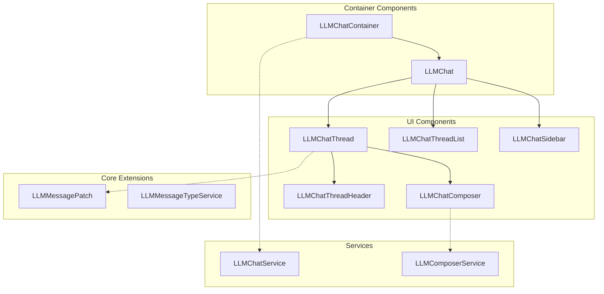
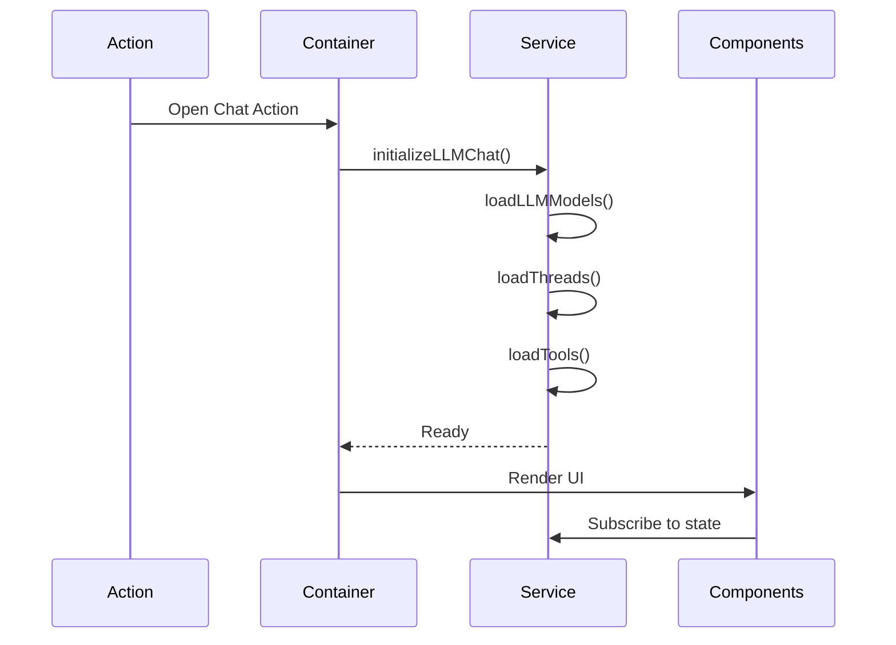

# JavaScript Components

The LLM Thread module uses Odoo's OWL (Odoo Web Library) framework for its frontend components. The architecture follows a service-based pattern with reactive state management.

## Component Architecture Overview



## Core Services

### LLMChatService

Central service managing all chat-related state and operations.

```javascript
export const LLMChatService = {
    dependencies: ["rpc", "user", "action", "notification", "orm"],
    
    start(env, { rpc, user, action, notification, orm }) {
        const store = reactive({
            llmChat: {
                // State
                llmChatView: null,
                activeThread: null,
                threads: [],
                llmModels: [],
                tools: [],
                
                // Methods
                async initializeLLMChat(actionData, initActiveId, postInitializationPromises = []) {},
                async loadThreads(additionalFields = [], forceReload = false) {},
                async createThread({ name, model, res_id }) {},
                async sendMessage(threadId, messageContent) {},
                
                // Computed properties
                get activeId() {},
                get orderedThreads() {},
                get defaultLLMModel() {},
            }
        });
        
        return store.llmChat;
    }
};
```

**Key Features**:
- Reactive state management using OWL's `reactive()`
- Thread lifecycle management
- Model and tool loading
- Event bus integration for extensibility

### LLMComposerService

Manages message composition and streaming responses.

```javascript
export const LLMComposerService = {
    dependencies: ["llm_chat", "rpc"],
    
    start(env, { llm_chat, rpc }) {
        return {
            async sendMessage(threadId, content) {
                // Handle message sending and streaming
            },
            
            handleStreamingResponse(eventSource) {
                // Process SSE events
            }
        };
    }
};
```

## Container Components

### LLMChatContainer

Root component that initializes the chat interface.

```javascript
export class LLMChatContainer extends Component {
    static template = "llm_thread.LLMChatContainer";
    static components = { LLMChat };
    static props = ["actionId", "initActiveId?"];
    
    setup() {
        this.llmChatService = useService("llm_chat");
        this.action = useService("action");
        
        onWillStart(async () => {
            await this.llmChatService.initializeLLMChat(
                this.props.action,
                this.props.initActiveId
            );
        });
    }
}
```

**Template Structure**:
```xml
<t t-name="llm_thread.LLMChatContainer">
    <div class="o_llm_chat_container">
        <LLMChat />
    </div>
</t>
```

### LLMChat

Main chat interface component managing layout and thread selection.

```javascript
export class LLMChat extends Component {
    static template = "llm_thread.LLMChat";
    static components = { 
        LLMChatSidebar, 
        LLMChatThread, 
        LLMChatThreadList 
    };
    
    setup() {
        this.llmChatService = useService("llm_chat");
        this.isMobile = useIsMobile();
        
        this.state = useState({
            showSidebar: !this.isMobile,
            showThreadList: false,
        });
    }
    
    get activeThread() {
        return this.llmChatService.activeThread;
    }
    
    async selectThread(thread) {
        await this.llmChatService.selectThread(thread.id);
        if (this.isMobile) {
            this.state.showSidebar = false;
        }
    }
}
```

## UI Components

### LLMChatThread

Displays the active chat thread with messages and composer.

```javascript
export class LLMChatThread extends Component {
    static template = "llm_thread.LLMChatThread";
    static components = { 
        LLMChatThreadHeader, 
        ThreadView,  // Odoo's native component
        LLMChatComposer 
    };
    static props = ["thread"];
    
    setup() {
        this.store = useStore();
        this.threadService = useService("mail.thread");
        
        // Create thread wrapper for Odoo's ThreadView
        this.threadWrapper = this.threadService.getThread(
            "llm.thread", 
            this.props.thread.id
        );
    }
}
```

### LLMChatComposer

Message input component with file attachment support.

```javascript
export class LLMChatComposer extends Component {
    static template = "llm_thread.LLMChatComposer";
    static props = ["thread", "onSend?"];
    
    setup() {
        this.composerService = useService("llm_composer");
        this.state = useState({
            message: "",
            isGenerating: false,
            attachments: [],
        });
        
        this.textareaRef = useRef("textarea");
        this.eventSource = null;
    }
    
    async sendMessage() {
        if (!this.state.message.trim() || this.state.isGenerating) {
            return;
        }
        
        const message = this.state.message;
        this.state.message = "";
        this.state.isGenerating = true;
        
        try {
            this.eventSource = await this.composerService.streamMessage(
                this.props.thread.id,
                message
            );
            
            this.eventSource.onmessage = (event) => {
                const data = JSON.parse(event.data);
                if (data.type === "done") {
                    this.onGenerationComplete();
                }
            };
        } catch (error) {
            this.handleError(error);
        }
    }
    
    onGenerationComplete() {
        this.state.isGenerating = false;
        if (this.eventSource) {
            this.eventSource.close();
            this.eventSource = null;
        }
    }
}
```

### LLMChatThreadList

Displays the list of available threads with search and filtering.

```javascript
export class LLMChatThreadList extends Component {
    static template = "llm_thread.LLMChatThreadList";
    static props = ["threads", "activeThread", "onSelectThread"];
    
    setup() {
        this.state = useState({
            searchTerm: "",
            filterModel: null,
        });
    }
    
    get filteredThreads() {
        let threads = this.props.threads;
        
        // Apply search filter
        if (this.state.searchTerm) {
            const term = this.state.searchTerm.toLowerCase();
            threads = threads.filter(t => 
                t.name.toLowerCase().includes(term)
            );
        }
        
        // Apply model filter
        if (this.state.filterModel) {
            threads = threads.filter(t => 
                t.llmModel?.id === this.state.filterModel
            );
        }
        
        return threads;
    }
}
```

## Core Patches and Extensions

### LLMMessagePatch

Extends Odoo's native Message component with AI-specific features.

```javascript
patch(Message.prototype, {
    setup() {
        super.setup();
        this.llmChatService = useService("llm_chat");
    },
    
    get isLLMMessage() {
        return this.message.model === "llm.thread";
    },
    
    get showVoting() {
        return this.isLLMMessage && 
               (this.message.is_llm_assistant_message || 
                this.message.is_llm_tool_result_message);
    },
    
    async vote(value) {
        await this.env.services.rpc("/llm/message/vote", {
            message_id: this.message.id,
            vote_value: value,
        });
    }
});
```

### LLMMessageTypeService

Registers custom message types for AI messages.

```javascript
export const LLMMessageTypeService = {
    dependencies: ["mail.message_type"],
    
    start(env, { mail }) {
        // Register LLM user message type
        mail.registerMessageType({
            id: "llm_user_message",
            icon: "fa-user",
            label: "User",
        });
        
        // Register LLM assistant message type
        mail.registerMessageType({
            id: "llm_assistant_message",
            icon: "fa-robot",
            label: "Assistant",
        });
        
        // Register LLM tool result type
        mail.registerMessageType({
            id: "llm_tool_result_message",
            icon: "fa-wrench",
            label: "Tool Result",
        });
    }
};
```

## Widget Components

### LLMFormButton

Button widget for form views to open chat for the current record.

```javascript
export class LLMFormButton extends Component {
    static template = "llm_thread.LLMFormButton";
    
    setup() {
        this.action = useService("action");
        this.llmChatService = useService("llm_chat");
    }
    
    async openChat() {
        const record = this.props.record;
        
        // Ensure thread exists for this record
        const thread = await this.llmChatService.ensureThread({
            model: record.resModel,
            res_id: record.resId,
        });
        
        // Open chat interface
        await this.action.doAction("llm_thread.action_llm_chat", {
            props: {
                initActiveId: `${record.resModel}_${record.resId}`,
            },
        });
    }
}

// Register as field widget
registry.category("fields").add("llm_chat_button", {
    component: LLMFormButton,
});
```

## Event System

The module uses Odoo's event bus for extensibility:

```javascript
// Extension points
env.bus.trigger("llm_chat:initializing", {
    actionData,
    initActiveId,
    service: llmChatService,
});

env.bus.trigger("llm_chat:threads_loaded", {
    threads: this.threads,
    service: this,
});

env.bus.trigger("llm_chat:message_sent", {
    threadId,
    message,
    response,
});
```

## Styling and SCSS

Each component has associated SCSS files following BEM naming:

```scss
// llm_chat.scss
.o_llm_chat {
    display: flex;
    height: 100%;
    
    &__sidebar {
        width: 300px;
        border-right: 1px solid $border-color;
    }
    
    &__content {
        flex: 1;
        display: flex;
        flex-direction: column;
    }
    
    &--mobile {
        .o_llm_chat__sidebar {
            position: absolute;
            width: 100%;
            z-index: 10;
        }
    }
}
```

## Component Lifecycle

### Initialization Flow



## Best Practices

1. **State Management**: Always use the centralized LLMChatService
2. **Error Handling**: Implement proper error boundaries and user feedback
3. **Performance**: Use computed properties for derived state
4. **Accessibility**: Include proper ARIA labels and keyboard navigation
5. **Mobile Support**: Test and optimize for mobile devices
6. **Event Cleanup**: Always clean up event listeners and EventSource connections