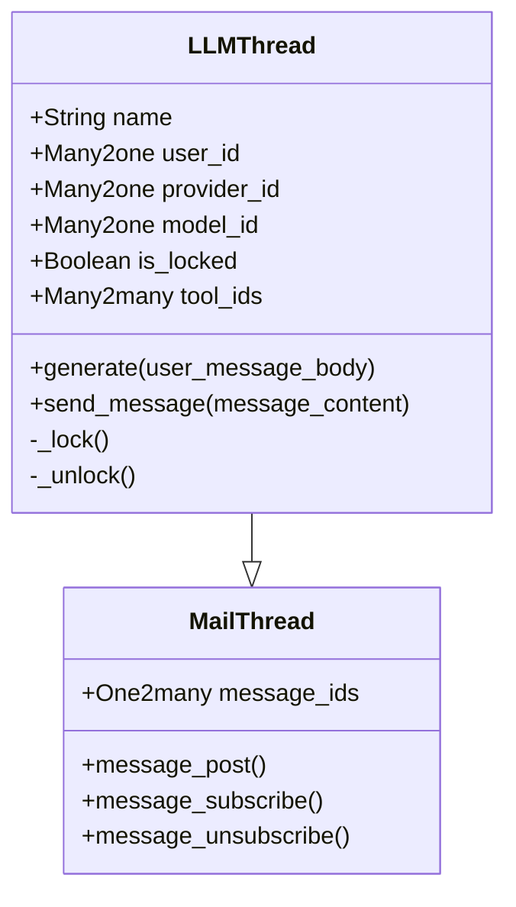
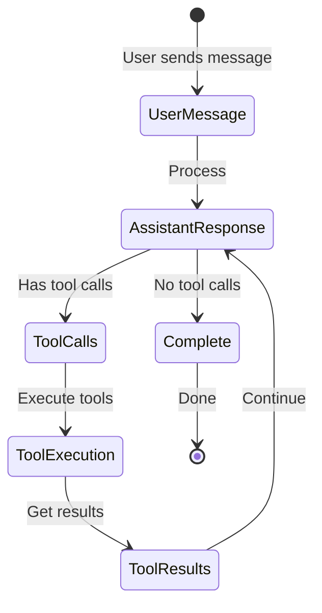

# Models

The LLM Thread module extends Odoo's mail system with AI-specific models and functionality.

## LLMThread Model

```python
class LLMThread(models.Model):
    _name = "llm.thread"
    _description = "LLM Chat Thread"
    _inherit = ["mail.thread"]
    _order = "write_date DESC"
```

The main model representing an AI chat conversation.

### Key Fields

| Field | Type | Description |
|-------|------|-------------|
| `name` | Char | Thread title (required) |
| `user_id` | Many2one (res.users) | Thread owner |
| `provider_id` | Many2one (llm.provider) | Selected AI provider |
| `model_id` | Many2one (llm.model) | Selected AI model |
| `active` | Boolean | Active flag for archiving |
| `message_ids` | One2many (mail.message) | Thread messages |
| `model` | Char | Related Odoo model name |
| `res_id` | Integer | Related record ID |
| `is_locked` | Boolean | Prevents concurrent generation |
| `tool_ids` | Many2many (llm.tool) | Available tools for this thread |
| `source` | Selection | Origin of thread (backend, api, website_livechat) |

### Inheritance Diagram



### Core Methods

#### `generate(user_message_body, **kwargs)`
Main orchestration method that handles the conversation flow:

```python
def generate(self, user_message_body, **kwargs):
    """
    Generator that orchestrates the conversation flow.
    Yields events for frontend consumption.
    
    Args:
        user_message_body: Initial user message or None to continue
        **kwargs: Additional message parameters
        
    Yields:
        dict: Events with type and data
    """
```

**Flow**:
1. Locks the thread to prevent concurrent generation
2. Posts user message (if provided)
3. Loops through assistant responses and tool calls
4. Yields events for streaming updates
5. Unlocks thread on completion

#### `send_message(message_content)`
Simplified message sending for API/RPC usage:

```python
def send_message(self, message_content):
    """
    Send a user message and trigger AI response.
    
    Args:
        message_content (str): The message to send
        
    Returns:
        dict: Success status and message info
    """
```

#### Thread Locking Mechanism

The module uses a sophisticated locking mechanism to prevent concurrent generation:

```python
@execute_with_new_cursor
def _lock(self):
    """Acquires lock with immediate commit in new cursor"""
    
@execute_with_new_cursor
def _unlock(self):
    """Releases lock with immediate commit in new cursor"""
```

The `@execute_with_new_cursor` decorator ensures lock operations are immediately committed, preventing race conditions.

### Message Orchestration



### Related Record Linking

Threads can be linked to any Odoo record using the `model` and `res_id` fields:

```python
# Example: Link thread to a sale order
thread = self.env['llm.thread'].create({
    'name': 'Chat about SO/2024/001',
    'model': 'sale.order',
    'res_id': sale_order.id,
    'model_id': llm_model.id,
    'provider_id': provider.id,
})
```

## MailMessage Extension

```python
class MailMessage(models.Model):
    _inherit = "mail.message"
```

Extends Odoo's mail messages with AI-specific functionality.

### Additional Fields

| Field | Type | Description |
|-------|------|-------------|
| `user_vote` | Integer | User feedback (-1, 0, 1) |
| `tool_calls` | Text (JSON) | Tool call definitions |
| `tool_call_id` | Char | Unique tool call identifier |
| `tool_call_definition` | Text (JSON) | Tool call request |
| `tool_call_result` | Text (JSON) | Tool execution result |

### Key Methods

#### `create_message_from_stream(thread, stream, subtype_xmlid, placeholder_text="…")`
Creates and updates messages from AI streaming responses:

```python
@api.model
def create_message_from_stream(self, thread, stream, subtype_xmlid, placeholder_text="…"):
    """
    Creates a message and updates it as streaming data arrives.
    
    Yields:
        dict: UI events (message_create, message_chunk, message_update)
    """
```

#### `stream_llm_tool_result(thread, tool_call_def)`
Handles tool execution and result posting:

```python
@api.model
def stream_llm_tool_result(self, thread, tool_call_def):
    """
    Executes a tool and posts the result as a message.
    
    Yields:
        dict: UI events for tool execution
    """
```

### Message Types

The module uses custom mail subtypes for different message types:

1. **User Messages** (`llm_user_subtype`)
2. **Assistant Messages** (`llm_assistant_subtype`)
3. **Tool Results** (`llm_tool_result_subtype`)

## Helper Methods and Hooks

### Message Preprocessing Hook

```python
def _get_prepend_messages(self):
    """
    Hook for adding system/context messages.
    Override in other modules to customize.
    
    Returns:
        list: Messages to prepend to conversation
    """
```

### Email Generation

```python
@api.model
def get_email_from(self, provider_name, provider_model_name, 
                   subtype_xmlid, author_id, tool_name=None):
    """
    Generates appropriate email addresses for AI messages.
    Examples:
        - "GPT-4 <ai@openai.ai>"
        - "Calculator <tool@openai.ai>"
    """
```

## Usage Examples

### Creating a Thread

```python
# Basic thread creation
thread = self.env['llm.thread'].create({
    'name': 'Product Analysis Chat',
    'provider_id': openai_provider.id,
    'model_id': gpt4_model.id,
    'tool_ids': [(6, 0, [web_search_tool.id, calculator_tool.id])],
})

# Thread linked to a record
thread = self.env['llm.thread'].create({
    'name': f'Support Chat - {ticket.name}',
    'model': 'helpdesk.ticket',
    'res_id': ticket.id,
    'provider_id': provider.id,
    'model_id': model.id,
})
```

### Generating Responses

```python
# Generate response with streaming
for event in thread.generate("What is the status of my order?"):
    if event['type'] == 'message_chunk':
        # Handle streaming update
        print(event['message']['body'])
    elif event['type'] == 'error':
        # Handle error
        print(f"Error: {event['error']}")
```

### Voting on Messages

```python
# Upvote a message
message = self.env['mail.message'].browse(message_id)
message.set_user_vote(message_id, 1)  # 1 = upvote, -1 = downvote, 0 = clear
```

## Performance Considerations

1. **Message Loading**: Messages are loaded on-demand with proper ordering
2. **Streaming**: Uses generators to avoid memory overhead
3. **Locking**: Cursor isolation prevents deadlocks
4. **Tool Execution**: Wrapped in savepoints for safe rollback

## Security

- Users can only access their own threads (see `security/llm_thread_security.xml`)
- Tool execution is permission-based
- Message voting restricted to AI-generated messages